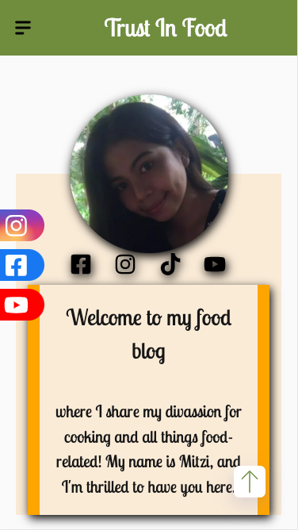

# Gatsby/React Website with Strapi CMS

This project is a Gatsby/React website that utilizes Strapi as a CMS (Content Management System). The website is designed to provide a seamless user experience and incorporates various features, including AWS for storing images, a Cookie Banner for privacy compliance, integration with Google AdSense and Analytics, Search Engine Optimization (SEO) optimization, the use of WebP format for images instead of JPG, and ensuring a secure HTTPS connection.

<div align="center">


</div>

## Getting Started

1. **Clone the Repository:**
   ```bash
   git clone https://github.com/your-username/gatsby-react-strapi-website.git
   ```

2. **Install Dependencies:**
   ```bash
   cd gatsby-react-strapi-website
   npm install
   ```

3. **Set up Strapi CMS:**
   - Follow the [Strapi installation guide](https://strapi.io/documentation/v3.x/getting-started/introduction.html) to set up and start your Strapi CMS server.
   - Configure Strapi according to your content model and requirements.

4. **Configure AWS for Image Storage:**
   - Set up an AWS account and create an S3 bucket for storing images.
   - Configure your Gatsby/React website to use AWS S3 for image storage. Update the necessary credentials in the appropriate configuration files.

5. **Integrate Cookie Banner:**
   - Include a Cookie Banner component to comply with privacy regulations. Customize the banner according to your website's privacy policy.

6. **Integrate Google AdSense/Analytics:**
   - Set up Google AdSense and Analytics accounts to obtain the necessary codes.
   - Integrate the generated codes into your Gatsby/React website for ad serving and analytics tracking.

7. **SEO Optimization:**
   - Ensure all pages have appropriate metadata, including titles, descriptions, and keywords.
   - Optimize images for SEO by using descriptive filenames and ALT text.
   - Configure a sitemap and robots.txt file for search engine crawlers.

8. **Use WebP Format for Images:**
   - Convert images to WebP format for improved performance and faster page loading.
   - Update image references in your Gatsby/React components to use the WebP format.

9. **Check HTTP/HTTPS Connection:**
   - Ensure that your website is served over HTTPS for a secure connection.
   - Use tools like [SSL Labs](https://www.ssllabs.com/) to check the SSL configuration.

10. **Run the Application:**
    ```bash
    gatsby develop
    ```

    The application should be accessible at `http://localhost:8000`.

## Features

### AWS for Image Storage
- Images are stored on AWS S3 for efficient and scalable storage.

### Cookie Banner
- A Cookie Banner is included to inform users about the use of cookies and comply with privacy regulations.

### Google AdSense/Analytics
- Integration with Google AdSense for ad serving and Google Analytics for website analytics.

### Search Engine Optimization (SEO)
- Pages are optimized for search engines with appropriate metadata, sitemap, and robots.txt configuration.

### WebP Image Format
- Images are served in the WebP format for improved performance and faster page loading.

### HTTPS Connection
- The website is served over a secure HTTPS connection to ensure data privacy and security.

## Dependencies

- [React](https://reactjs.org/)
- [Gatsby](https://www.gatsbyjs.com/)
- [Strapi CMS](https://strapi.io/)
- [AWS S3](https://aws.amazon.com/s3/)

## Configuration

- Configure Strapi according to your content model and requirements.
- Update AWS S3 credentials in the Gatsby/React website configuration for image storage.
- Customize the Cookie Banner according to your privacy policy.

## Contributing

If you'd like to contribute to the project, please follow the [contribution guidelines](CONTRIBUTING.md).

## License

This project is licensed under the [MIT License](LICENSE.md).

<div align="center">


</div>

<div align="center">

</div>